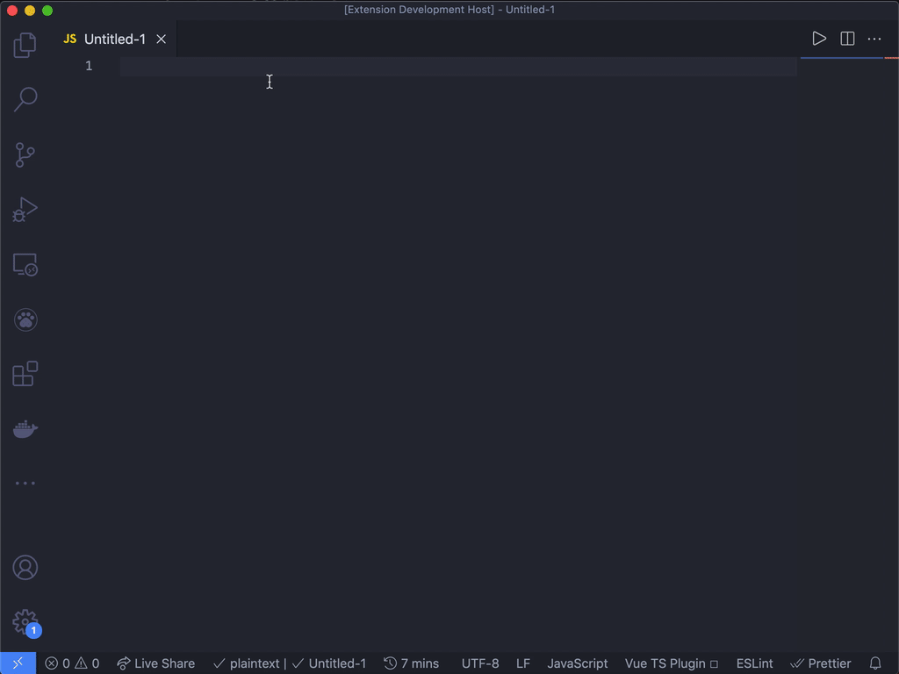

# vue-storybook-snippets README

## Features

This an extension to provide snippets of storybook configures file in a vue project.

## Snippet Prefixes

| Prefix | Description                |
| ------ | -------------------------- |
| vs2    | Snippets for Vue2 Projects |
| vs3    | Snippets for Vue3 Projects |

## Usage

Use `vs2` or `vs3` to generate YourComponent.stories.js file automatically.

## Release Notes

### 0.0.1

Initial release.

### 0.0.5

Updated snippets and added icon.
## Feedback

Please send any feedback or suggestions by creating issues on GitHub.

If this helps you, please leave a 🌟 at the GitHub repo.
## License

MIT
